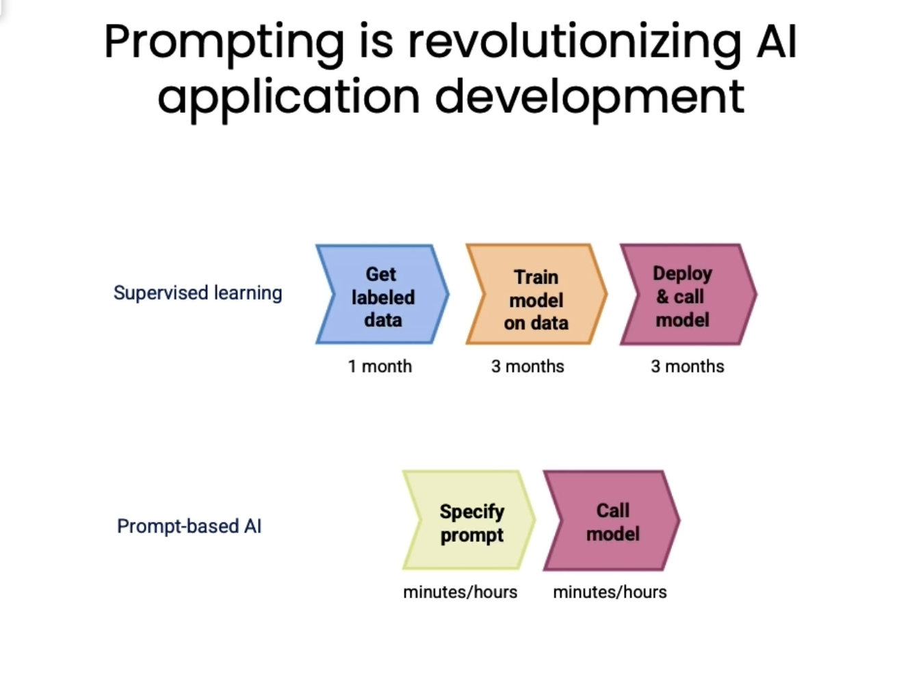
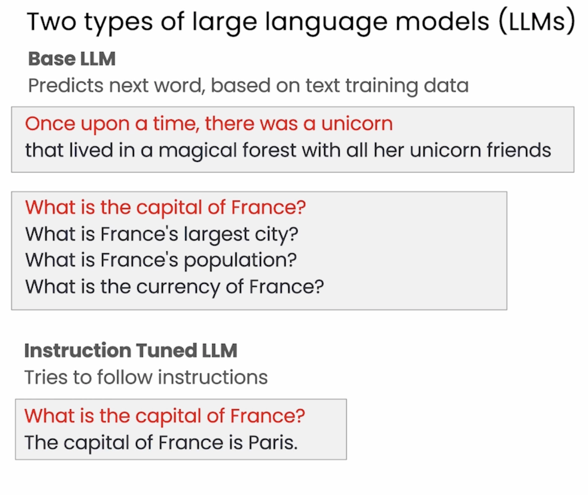
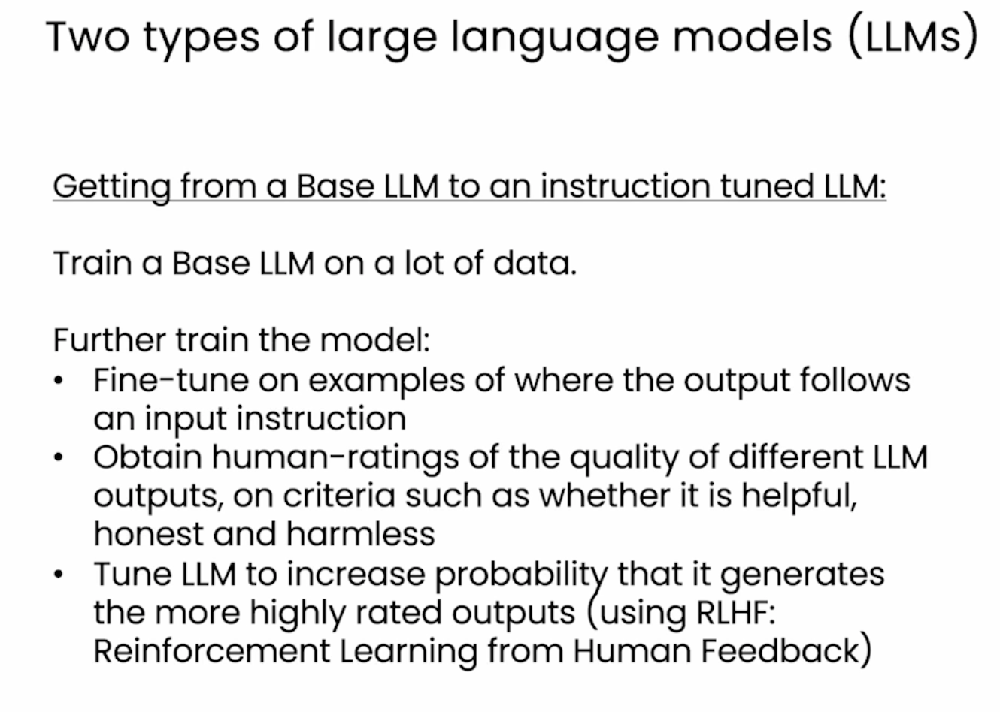
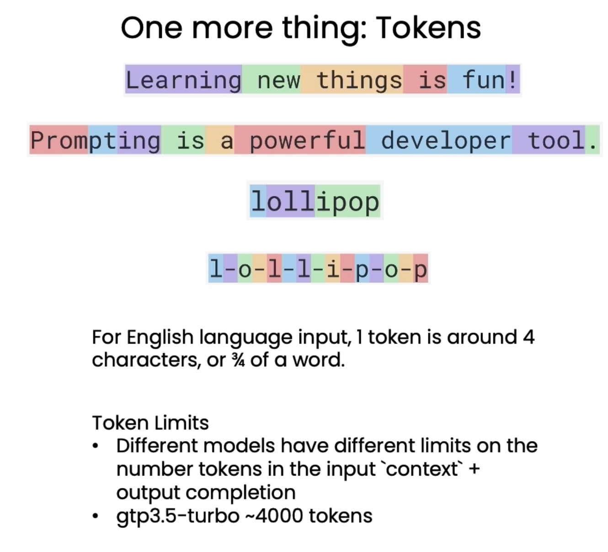
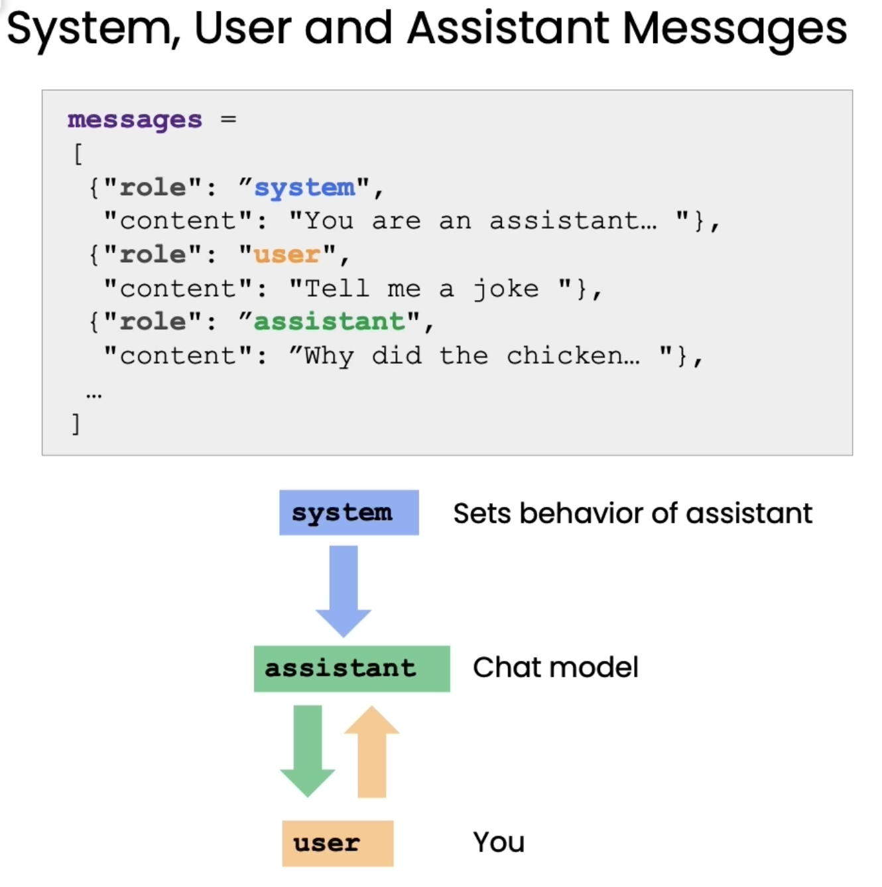
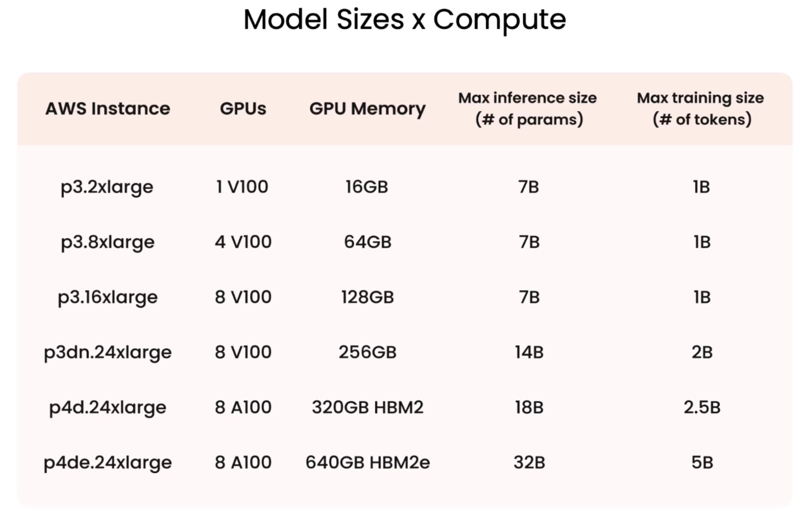
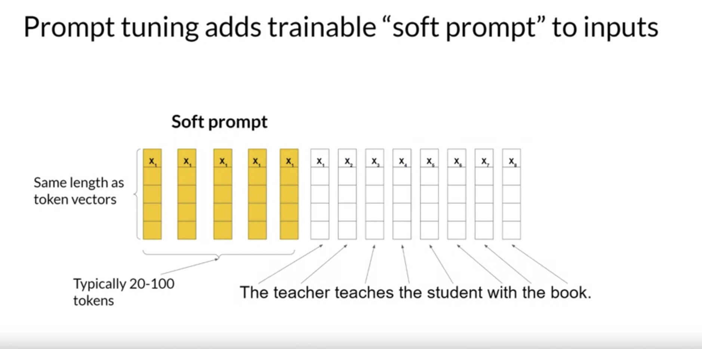

## Encoder only : Autoencoding
- ```Masked Language Models (MLM)```, fill in blanks
- work as sequence-to-sequence models
- Same length input and output. Mask the tokens. Bidirectional
- Less used but can be trained for Classification task, sentiment analysis, Named Entity Recognition, word classification  E.g. ``BERT``, ```ROBERTA``` 

## Encoder & Decoder : Span Corruption
- Masks random sequence of tokens, these are then replaced with sentinel token,
Mask |Mask = X : ```Sentinel token```
- Sentinel Token - special token added to vocabulary but are not from input text. Next the decoder is tasked to reconstruct the masked sequence auto regressively 
- Perform well on sequence-to-sequence tasks such as translation, text summarisation, Q&A
- The input sequence and the output sequence can be different lengths
- Can scale and train this type of model to perform general text generation tasks
E.g. ```BART``` and ```T5```

## Decoder-only models : Auto regressive Models; 
- ```Casual Language Model (CML)```, next word in sentence
- As they have scaled, their capabilities have grown. 
- ```Unidirectional```
- These models can now generalize to most tasks. 
Examples - GPT family of models,`` BLOOM``, ``Jurassic``, ``LLaMA``, Text generation


### Others 

- Understanding of self-attention and multi-headed self-attention mechanism
- Attention mechanisms in transformers are parallelizable, making them efficient on GPUs
----

- Transformer's power comes from learning relevance and context of all words in a sentence, using attention weights.
- Attention weights apply to all words, allowing model to understand relationships and relevance.
- Attention weights are learned during LLM training
- Simplified transformer architecture is divided into encoder and decoder parts.
- Tokenization converts words to numbers, representing positions in a word dictionary.
- Tokenizer choice must remain consistent for training and text generation.
- Token numbers are passed to an embedding layer, forming vectors that encode meaning and context.
- Embedding vector spaces preserve relationships and distances between words.
- Positional encoding retains word order relevance in the input.
- Self-attention layer analyzes relationships between input tokens, allowing model to capture contextual dependencies.- 
- Multi-headed self-attention uses multiple sets of weights to learn different aspects of language.
- The number of attention heads varies, and each learns different language aspects.
- Multi-headed self-attention weights are randomly initialized and learn various language aspects.
- Output passes through a feed-forward network, resulting in logits proportional to token probabilities.
- Softmax layer normalizes logits into probability scores for each word.
- The most likely predicted token has the highest probability score.

----

- Overview of the translation task using a transformer model.
- Tokenization of input words using the same tokenizer as in training.
- Tokens added to encoder side, go through embedding layer, then multi-headed attention layers.
- Multi-headed attention outputs pass through feed-forward network to encoder's output.
- Encoder's deep representation of input structure and meaning inserted into decoder.
- Start of sequence token added to decoder input, which predicts next token using encoder's contextual understanding.
- Decoder's self-attention outputs pass through decoder feed-forward network and softmax layer, generating output token.
- Loop continues until end-of-sequence token is predicted, producing final sequence.
- Different ways to use softmax output influence text creativity.
- Complete transformer architecture has encoder and decoder components.
- Encoder encodes input, decoder generates tokens using encoder's understanding.
- Encoder-only models perform classification tasks, while encoder-decoder models work on sequence-to-sequence tasks.
- Decoder-only models like GPT family are commonly used and versatile.

----

- Methods and parameters to influence model's next-word generation decision.
- Configuration parameters adjust model's behavior during inference, separate from training parameters.
- Max new tokens limits generated tokens, setting cap on selection process.
- Greedy decoding chooses highest probability word, susceptible to repetition.
- Random sampling introduces variability, reduces word repetition, may lead to overly creative output.
- Top k sampling restricts model to top k highest probability tokens, balancing randomness and sense.
- Top p sampling limits sampling to tokens with probabilities not exceeding p, increasing sense.
- Temperature parameter affects randomness, higher temp = higher randomness, lower temp = lower randomness.
- Lower temperature concentrates probability on few likely words, less random output.
- Higher temperature spreads probability across tokens, more random output.


- Generative AI project life cycle for LLM-powered applications.
- Defining scope of the project is crucial to narrow down model requirements.
- Decide whether to use existing base model or train a new one.
- Assess model's performance and use prompt engineering or fine-tuning.
- Evaluation metrics and benchmarks to assess model performance.
- Iterative process of adapting and aligning model to performance needs.
- Optimize model for deployment to maximize resource utilization and user experience.
- Consider additional infrastructure to address LLM limitations.

### Prompting


### Types of LLM


### Base Model to Instruct Model


### Tokens


### System, Assistant, User


### Model Size & Compute


### Soft Prompt
