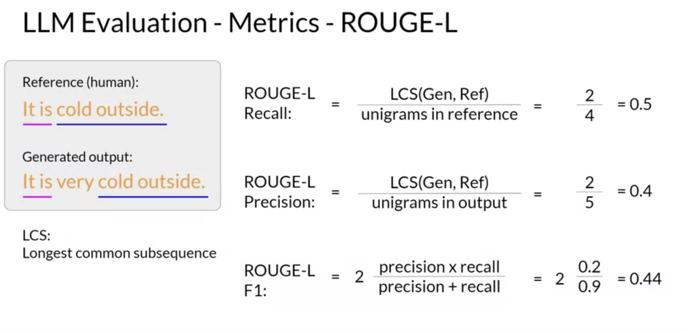

# Instruction Finetuning

### Why Needed?
- Prompt Engineering has a ceiling for performance
- Context size becomes large, while giving examples to pre-trained models
- Zero shot and Few shot doesn't work well with smaller models
- To improve the performance and adaptability of a pre-trained language model for specific tasks

Instructions Finetuning
- Needs 3 things
    1. Prompt Instruction (e.g. Summarize the following questions)
    2. [Example text]
    3. [Example completion]

> Prompt Instruction templates

### Catastrophic forgetting

* Catastrophic Forgetting : Model forgets other tasks ; reduction in ability to perform on other tasks
* Catastrophic forgetting is a problem in both supervised and unsupervised learning tasks
* Catastrophic forgetting occurs when a machine learning model forgets previously learned information as it learns new information.
* Catastrophic forgetting is a common problem in machine learning, especially in deep learning models.

**Catastrophic forgetting can be reduce by -**
    1. No need to reduce
    2. Multi-task fine tuning. Fine tune on many other tasks as well (requires more effort in data prep)
    3. ```PEFT```, Parametric efficient fine tuning (most of the parameters remain unchanged)

One way to mitigate catastrophic forgetting is by using regularization techniques to limit the amount of change that can be made to the weights of the model during training.

## FLAN (Fine-tuned LAnguage Net)
E.g. of Multi-task Instruction fine tuning 
- Changes all parameters of the model
- FLAN-T5 is finetuned instruct model on T5
- FLAN-PALM is finetuned instruct model on PALM

USE CASE : CUSTOMER SUPPORT DIALOGUE SUMMARY
* Open source dataset : dialogsum


### LLM Evaluation Challenges
- Output is non determistic and language based

#### 1. ROUGE
- Used for text summary
- Comapares summary to one or more summary

unigram, bigram, n-gram

ROUGE-1, Recall = unigram matches / unigram in reference


**Longest common subsequence**


Problems
- Order of words, 
- No semantic
- Contradictory words in between would be disaster


#### 2. BLEU SCORE
- Used in text translation
- Conpares to human generated translations


### BENCHMARKING MODELS
& Leaderboards 

#### 1. GLUE
#### 2. SUPERGLUE
#### 3. MMLU

#### 4. HELM


## PEFT : Parameter Efficient Finetuning


#### Transformers
- Self Attention weights
- Feed forward weights


#### PEFT method-1: LoRA (Low Rank Adaptation for LLM)
Modifying self attentio weight is enough for finetuning


Example : Here, BxA = 512x8 x 8x64 = 512x64
1. Train different low rank decomposition matrices for different tasks
2. At inference time, use weights specific to tasks


#### PEFT method-2: Soft Prompts


```Prompt Engineering``` vrs ```Prompt Tuning```

Soft Prompt is prompt tuning where :
- No weights are updated or fine tuned
- Prepended with Virtual tokens that can take any continuous value in multi dimensional space.
(After finetuning they form form type semantic clusters)
- The embedding vectors of the soft prompt gets updated over time to optimize the model's completion of the prompt during fine tuning.

```QLoRA``` Combine LoRA with the quantization techniques to further reduce your memory footprint.

### ```Full fine tuning``` vrs ```PEFT```
 
```Challenges that PEFT tries to overcome``` from full fine-training:
1. ```Catastrophic Forgetting``` : With PEFT, most parameters of the LLM are unchanged, and that helps making it less prone to catastrophic forgetting.
2. ```Storage requirements``` : With PEFT, we can change just a small amount of parameters when fine-tuning, so during inference you can combine the original model with the new parameters, instead of duplicating the entire model for each new task you want to perform fine-tuning.
3. ```Computational constraints``` : Because most parameters are frozen, we typically only need to train 15%-20% of the original LLM weights, making the training process less expensive (less memory required)


